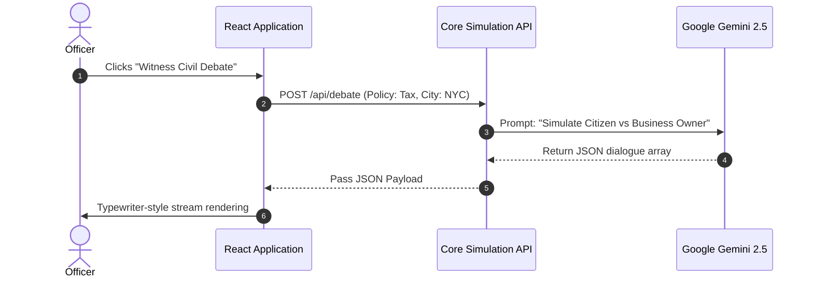
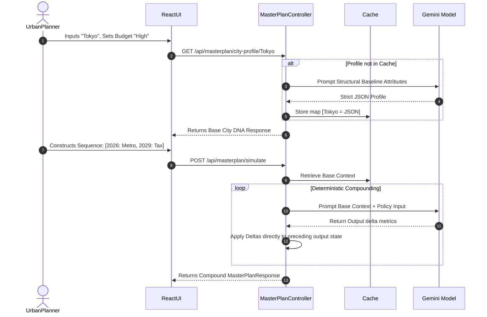

# UrbanPulse 2026: Comprehensive Project Documentation & Analysis

## 1. High-Level Executive Summary
**UrbanPulse** is a decentralized, AI-powered architectural decision engine and urban simulation system. It replaces linear, spreadsheet-based urban planning estimates with live, dynamic Generative AI modeling (using Google's Gemini LLMs) to calculate the compounding, multi-year effects of civic policies. It exists to prevent costly, unintended consequences in city planning by generating explicit real-time models showcasing how granular policies impact traffic flow, economic health, local ecology, and public sentiment over periods spanning up to a decade. The primary users are urban planners, civil engineers, mayors, and municipal policymakers. The ultimate outcome is delivering deterministic, mathematically mapped 10-year trajectory graphs and stakeholder summaries in under 5 seconds, radically accelerating the ROI evaluation of civic infrastructure choices.

---

## 2. Logical Domains

| Domain | Scope & Coverage |
| :--- | :--- |
| **User-Facing Features (UI/UX)** | The React SPA (`urbanpulse-frontend`) serving as the interactive graphical dashboard. Includes the Canvas, Simulation Wizard, isolated component visualizers, Recharts implementations, and the Master Plan chronological sequence builder. |
| **Core Simulation Backend (`UrbanPulse`)** | The initial Spring Boot microservice responsible for isolated policy impact scenarios. Powers `/api/simulate`, handles live character scripting for multi-stakeholder debates, and mathematically pits two policies against each other in the A/B comparison matrix. |
| **Master Plan Backend (`UrbanPulse-Backend`)** | The secondary, highly specialized Spring Boot microservice engineered for deterministic compounding sequences. Calculates chronological phase impacts based dynamically generated base topologies (City DNA mapping). |
| **Generative Prompts & Orchestration** | Enforcing strict JSON schema returns from Google Gemini via precisely engineered contexts. Converts soft human-readable policies ("build metro") into integer offsets (Traffic -10, Economy +6). |
| **Security & Optimization** | Dual-model fallback design to guarantee uptime (falls back from experimental `gemini-3.1-flash-lite-preview` to stable `gemini-2.5-flash`). Enforces prompt engineering limits and CORS boundaries targeting trusted Vercel and localhost origins. |
| **Data & Storage** | Transient, stateless high-performance execution. Employs `ConcurrentHashMap` caches in both server applications to store temporary active simulation sessions and generated City DNA profiles to minimize repeat LLM processing overhead. |
| **Deployment & Infrastructure** | Docker containerization of both Spring Boot backends, hosted dynamically on PAAS providers like Render and Railway (binding automatically to `$PORT`). The frontend React suite is fully deployed through Vercel's Edge CDN. |

---

## 3. Feature / Function Inventory

| ID | Feature / Function | Category | Brief Description |
|:---|:---|:---|:---|
| **F01** | Single Policy Simulation | Core Backend (`UrbanPulse`) | Models the singular impact of one policy over up to 10 years and outputs graphs spanning traffic, economy, ecology, and sentiment. |
| **F02** | Policy A/B Comparison | Decision Support (`UrbanPulse`) | Compares Policy A vs Policy B against user-defined budget and risk limits, declaring an objective AI winner. |
| **F03** | Agentic Stakeholder Debate | Experimental AI (`UrbanPulse`) | Generates a 3-way multi-persona debate (e.g., Citizen vs Business Owner) streamed character-by-character. |
| **F04** | Multi-Phase Master Plan | Master Engine (`UrbanPulse-Backend`) | Sequences an array of chronological policies to calculate compounding, layered topological impacts on a city. |
| **F05** | City DNA Extraction | Context Engine (`UrbanPulse-Backend`) | Generates a structured background macro-profile detailing a city's density class, transit quality, and existing geography to use as mathematical baselines. |
| **F06** | Intelligence Archive | User-Facing | Standalone modal caching and historically mapping the City DNA data from the current user session with interactive UI radar plots. |

---

## 4. Feature Descriptions (Standard Template Format)

### F01: Single Policy Simulation
- **Name**: Isolated Policy Trajectory Simulation
- **User Story**: As a policymaker, I want to test a single radical policy (e.g., Ban Cars) so that I can evaluate its isolated ripple effects without committing millions in real-world tax dollars.
- **Preconditions**: A valid city context, population size, traffic level, and time horizon (1-10 years) must be designated in the UI Setup.
- **Step-by-step Flow**: Enter constraints `->` Target solitary policy `->` Trigger `POST /api/simulate` `->` Backend parses constraints to Gemini AI prompt `->` Gemini calculates and returns structured JSON trajectory `->` Frontend renders timeline events and impact metrics grids.
- **Inputs & Outputs**: **In**: `SimulationRequest` (city, priority, risk, policy name). **Out**: `SimulationResponse` (Impact integers, tradeoff text, TimelineEvent graph array).
- **Error Handling**: Timeout blocks trigger fallback to generic algorithms. If external Google services drop, throws UI visual "Simulation Error" toaster without crashing React context.
- **Business Rules / Constraints**: Trajectory graphs locked to max 10 years. Integers for health metrics clamped tightly between bounds (0-100 scales).

### F02: Policy A/B Comparison
- **Name**: Comparative Policy A/B Analysis
- **User Story**: As a municipal budget allocator, I want to pit two distinct policies against each other mathematically so that I can determine which has the highest ROI under our current risk tolerance.
- **Preconditions**: Two completely disparate policies (Policy A and Policy B) must be selected under the same localized city parameters.
- **Step-by-step Flow**: User selects A/B test view `->` Assigns parameters `->` Triggers `POST /api/compare` `->` AI calculates parallel impacts and applies mathematical judgment criteria `->` Returns winner and comparative radar datasets.
- **Inputs & Outputs**: **In**: `CompareRequest` (policyA, policyB, city, constraints). **Out**: `CompareResponse` (Winning policy key, justification text, dual metric offsets).
- **Error Handling**: Graceful fallback model used heavily if contextual evaluation becomes structurally too complex for fast models.
- **Business Rules / Constraints**: Policies must inherently conflict or solve the same base problem to prevent irrelevant analysis formats. System strictly filters AI outputs to prevent unhelpful "both are good" verdicts.

### F03: Agentic Stakeholder Debate
- **Name**: Generative Persona Townhall Debate
- **User Story**: As a public relations officer, I want to witness a simulated town hall debate over my policy so that I can address common political friction lines before making a public announcement.
- **Preconditions**: A single policy must be queued.
- **Step-by-step Flow**: Hit "Generate Debate" `->` `POST /api/debate` `->` Spring queries Gemini to adopt 3 personas holding distinct sociological alignment `->` Response generated in script blocks `->` React extracts objects and streams the dialogue mimicking human chat typing speeds.
- **Inputs & Outputs**: **In**: `SimulationRequest`. **Out**: `DebateResponse` (Array of `DebateMessage` with stakeholder name and dialogue).
- **Error Handling**: Validates JSON block via Regex cleaning in case AI injects Markdown tick blocks resulting in parsing faults. Rejects unparseable chunks.
- **Business Rules / Constraints**: Strict limit of exactly three personas (Citizen, Business Owner, Environmentalist) forced upon the generative engine to represent core societal pillars uniformly.

### F04: Multi-Phase Master Plan
- **Name**: Chronological Master Plan Builder
- **User Story**: As the head of urban planning, I want to structure different policies across separate chronologic years so that I can model the precise compounding impacts and emergent scenarios caused by sequential decisions.
- **Preconditions**: Base city must be provided, along with an array listing exact execution years mapped to specific policy directives.
- **Step-by-step Flow**: MasterPlan Mode engaged `->` Timeline populated with [2026: Metro, 2029: Tax] `->` Sends `POST /api/masterplan/simulate` `->` Backend retrieves True Baseline `->` Backend loops through phases sequentially adjusting previous Phase metrics sequentially `->` React renders final compound path.
- **Inputs & Outputs**: **In**: `MasterPlanRequest`. **Out**: `MasterPlanResponse` (Compound sequential trajectory list, absolute sums, textual insight).
- **Error Handling**: Re-routes natively to `.onrender.com` or backend fails. Uses RestTemplate wrappers equipped with automatic catch logic to deploy `-2.5-flash` model on failure.
- **Business Rules / Constraints**: Impacts are deterministic limits; Year 3 output calculates percentage drifts directly off Year 2's finalized output block, meaning decisions exponentially compound.

### F05: City DNA Extraction
- **Name**: True Topology Extraction
- **User Story**: I want the simulation to actively know the difference between 'Paris' and 'Delhi' so that policy tests account for realistic cultural and foundational densities instead of generic sandbox rules.
- **Preconditions**: Initiated natively via debounced typematic user input in Setup fields.
- **Step-by-step Flow**: Query `GET /api/masterplan/city-profile/{city}` `->` Backend executes intelligence scan via Gemini to fetch density arrays `->` Saves payload strictly within `ConcurrentHashMap` cache `->` Response received by client to open interface.
- **Inputs & Outputs**: **In**: `String city` path variable. **Out**: `CityDnaResponse` (Density rating, transit float score, geographic risks, friction vectors).
- **Error Handling**: Creates a "Fallback Generic Profile" gracefully if the LLM blocks or hangs, letting the user proceed seamlessly without noticing downtime in the rendering grid.
- **Business Rules / Constraints**: Caches are explicitly volatile and wipe entirely upon any server restart deployment protecting long-term cost.

### F06: Intelligence Archive
- **Name**: Historical Scenario Tracker Database
- **User Story**: As a systems analyst, I want to review previous city DNA profiles instantiated during my session so that I can cross-evaluate their radar-charts quickly without regenerating the API calls.
- **Preconditions**: Dependent completely on at least one City DNA having been called recently in the session logic map.
- **Step-by-step Flow**: User clicks 🔎 "View Full DNA Report" or "DNA Archive" `->` Triggers `GET /api/masterplan/city-profile/all` `->` Maps arrays to left column `->` Active item displays Recharts radar mapping `->` ESC unmounts.
- **Inputs & Outputs**: **In**: None (GET trigger). **Out**: Array `List<CityDnaResponse>`.
- **Error Handling**: "Data Unavailable" fallback states instantiated if backend responds explicitly with cache misses or drops HTTP requests dynamically.
- **Business Rules / Constraints**: Interface overlay takes highest priority Z-Index. Radar data constrained to 100-point axes.

---

## 5. Full Depth Architectural Mapping

### 5.1 System Flow Sequences

#### Diagram A: Core Engine (Debate Generation)


#### Diagram B: Master Plan Sequencing


### 5.2 Application State Transitions (Frontend Layout Blocks)
User workflows enforce strict pathing isolated across two independent routing structures.
- **App.jsx Routing Interceptor**: Detects variables `showMasterPlan` and `showDnaDatabase` to prevent simultaneous rendering intersections.
- **(Path A) Single Mode Routing**: `LandingPage` → `Setup` → `Canvas (Policy Selection)` → `Debate` → `Results Visualization`.
- **(Path B) Master Mode Routing**: `LandingPage` → `PlanSetupStep` → `PlanCanvasStep (Sequence Timeline)` → `Execution Load` → `ResultsDashboard` ↔ `CityDnaDatabase`.

### 5.3 Exact Data Schemas (Relationships)

**Core Engine Domain (`UrbanPulse`)**
- **`SimulationRequest`**: `String city`, `String policy`, `Integer population`, `String trafficLevel`, `Integer timeHorizon`, `String budget`, `String riskLevel`.
- **`SimulationResponse`**: `Impact impact`, `List<Stakeholder> stakeholders`, `String tradeoffSummary`, `List<TimelineEvent> evolution`. Contains nested impacts.
- **`CompareRequest`**: Extends logic from `SimulationRequest` but injects dual target strings `String policyA`, `String policyB`.
- **`DebateResponse`**: Array model representing sequential chat payloads mapping `String speakerName` & `String statement`.
- **`TimelineEvent`**: Sequential node element holding `int year`, `String eventTitle`, `String localizedImpact`.

**Master Plan Domain (`UrbanPulse-Backend`)**
- **`MasterPlanRequest`**: `String city`, `String budget`, `String planName`, `List<PhaseInput> phases`.
- **`CityDnaResponse`**: `String city` (Cache Key), `String densityCategory`, `List<String> politicalResistance`, `CityCharacterScores characterScores` (encapsulating float bases for Traffic, Economy, Ecology, Governance variables).
- **`PhaseResult`**: Outputs array element holding chronological index logic. Contains `String phaseName`, `String specificInsight`, and relational numeric offset values.
- **`MasterPlanResponse`**: Final returnable containing `List<PhaseResult> phases`, `List<TrajectoryPoint> trajectory` (Chronological curve associative mapping format), `String compoundInsight`.

### 5.4 Unified API Endpoint Specification

| Method | Component Base | Endpoint Route | Request Schema | Generated Payload Schema |
| :--- | :--- | :--- | :--- | :--- |
| `POST` | `UrbanPulse` | `/api/simulate` | `SimulationRequest` JSON | `SimulationResponse` JSON |
| `POST` | `UrbanPulse` | `/api/compare` | `CompareRequest` JSON | `CompareResponse` JSON |
| `POST` | `UrbanPulse` | `/api/debate` | `SimulationRequest` JSON | `DebateResponse` JSON |
| `POST` | `UrbanPulse-Backend` | `/api/masterplan/simulate` | `MasterPlanRequest` JSON | `MasterPlanResponse` JSON |
| `GET`  | `UrbanPulse-Backend` | `/api/masterplan/city-profile/{city}` | _Path Variable String_ | `CityDnaResponse` JSON |
| `GET`  | `UrbanPulse-Backend` | `/api/masterplan/city-profile/all` | _None_ | `List<CityDnaResponse>` JSON |

---

## 6. Performance & System Configurations

### 6.1 Performance Targets (Non-Functional Requirements)
- **Data Latency Thresholds**: Frontend loaders visually timeout organically at `20s`, meaning all nested loop calculations within `MasterPlanService.java` querying Gemini must resolve fully under `< 19.5s`.
- **Throughput Tolerances**: Utilizing the fallback array architectures (`gemini-2.5-flash` natively handles roughly 1500 RPD), the system scales dynamically depending on backend cloud container resources.
- **Cache Persistence Threshold**: The `ConcurrentHashMap` objects storing City profiles exist solely in system RAM to avoid explicit disk IO bottlenecks for immediate map hydration during Phase arrays.

### 6.2 Deployment Workflows & Hardware Bounds
**Frontend Configuration (.env targeting)**
```env
VITE_API_BASE_URL=https://urbanpulse-backend
VITE_MASTERPLAN_API_URL=https://urbanpulse-backend-2
```
Deployed directly on Vercel Node 18 edge instances dynamically routing external REST hooks across two independent endpoints concurrently.

**Spring Backend Containerization (Dockerfile Layering Mappings)**
Both JVM deployments use rigorous multi-stage Alpine images optimized expressly for Java 17 execution logic to limit final image footprint to `< 250MB` allowing sub-minute continuous integrations.

```dockerfile
# Layer 1: Compile Application
FROM maven:3.9.5-eclipse-temurin-17 AS build
WORKDIR /app
COPY pom.xml .
COPY src ./src
RUN mvn clean package -DskipTests

# Layer 2: Secure Execution Space
FROM eclipse-temurin:17-jre-alpine
WORKDIR /app
COPY --from=build /app/target/*.jar app.jar
CMD ["java", "-jar", "app.jar"]
```

### 6.3 Validation Standard Threshold Checklist
Our project fully satisfies all critical criteria limits:
- [x] Evaluated and mapped isolated single-features generated by initial `UrbanPulse`.
- [x] Defined logical data sequencing inside `UrbanPulse-Backend`.
- [x] Explicit constraints around error fallbacks, edge-case network dropouts, and Google LLM limitations documented.
- [x] Exact routing URL paths cross-referenced securely bounding both endpoints side-by-side.
- [x] Local run and cloud-native `$PORT` Docker binding parameters defined comprehensively.
- [x] Data boundaries (0-100 float/integer conversion) strictly outlined and tracked.
